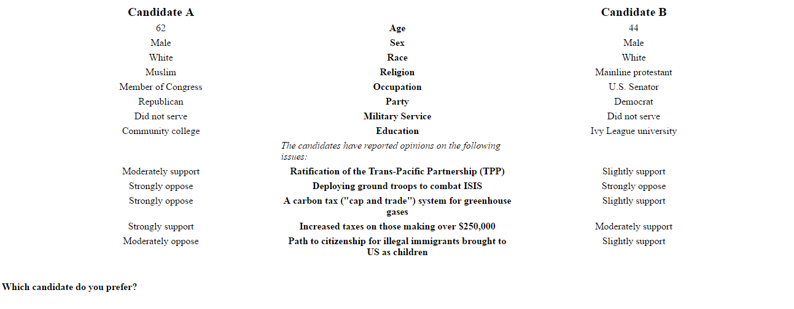
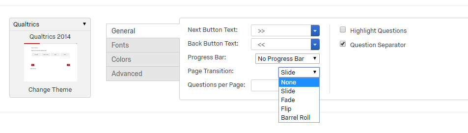

# Example Conjoint Experimental Design in Qualtrics

This is an example of conducting a conjoint experiment in Qualtrics. It benefitted heavily from Kyle Dropp's guide, ["Implementing a Conjoint Analysis in Qualtrics"](http://www.weebly.com/uploads/1/2/0/9/12094568/conjoint.pdf).

A conjoint is a fully randomized, factorial experiment involving a potentially large number of factors and factor levels. Typically, participants are exposed to a vignette wherein features of the vignette (e.g., a person description) are randomized. To gain statistical power and to avoid severe sparsity problems in such a high-dimensional design, within-subjects comparisons are typically leveraged. That is, a respondent may be exposed to 5-10 vignettes in order to multiple the statistical power of the design (under some plausible assumptions). 

For example, in this example, participants are shown descriptions of two hypothetical political candidates with numerous demographic and attitudinal features:



Participants then indicate which of the two alternatives they prefer and the data are analyzed using regression with respondent fixed effects (and/or standard errors clustered by respondent) in order to estimate the marginal contribution of each feature (trait factor) averaging across all of the other combinations of feature levels.

This design creates approximately 2.5 million experimental cells. So it is impossible to physically create every possible combination of candidate profiles. Thus to actually conduct this experiment requires some dynamic programming that generates the profiles randomly. Building on Dropp's techniques, I show how we (Joshua Robison, Aarhus University) and I implemented this in Qualtrics.

The basic workflow is this:

 1. Create a "template" HTML document that lays out the candidate profiles, without any of the feature information populated. Use this template as the body of a Qualtrics multiple choice question.
 
 2. Write a small js script that randomly samples from all possible traits and save this as javascript in the Qualtrics question. The js script should also save the profile data to Qualtrics ["embedded data"](https://www.qualtrics.com/support/survey-platform/survey-module/survey-flow/standard-elements/embedded-data/) fields so that it the output data file contains a record of which profiles were shown to which respondents.
 
 3. Repeat this for however many profiles are needed. We used 5 in this study, so that each respondent was shown five pairs of candidates. In essence this multiplies our sample size from `n=600` to `n=3000` minus whatever uncertainty is introduced by using non-independent observations.
 
 4. Run the study, download the data, and construct profile-describing variables from stored profile information.
 
## 1. HTML Template

A complete template HTML file is provided in [template.html](template.html). It is simply an HTML file:

```html
<table style="width:90%; align:center; margin-left:auto; margin-right:auto; text-align:center; table-layout:fixed;" cellspacing="4" >
    <tr>
        <td style="font-weight:bold; font-size:1.25em; font-align:center;">Candidate A</td>
        <td></td>
        <td style="font-weight:bold; font-size:1.25em; font-align:center;">Candidate B</td>
    </tr>
    <tr>
        <td id="a1"></td>
        <td style="font-weight:bold;">Age</td>
        <td id="b1"></td>
    </tr>
    <tr>
        <td id="a2"></td>
        <td style="font-weight:bold;">Sex</td>
        <td id="b2"></td>
    </tr>
    <tr>
        <td id="a3"></td>
        <td style="font-weight:bold;">Race</td>
        <td id="b3"></td>
    </tr>
    <tr>
        <td id="a4"></td>
        <td style="font-weight:bold;">Religion</td>
        <td id="b4"></td>
    </tr>
    <tr>
        <td id="a5"></td>
        <td style="font-weight:bold;">Occupation</td>
        <td id="b5"></td>
    </tr>
    <tr>
        <td id="a6"></td>
        <td style="font-weight:bold;">Party</td>
        <td id="b6"></td>
    </tr>
    <tr>
        <td id="a7"></td>
        <td style="font-weight:bold;">Military Service</td>
        <td id="b7"></td>
    </tr>
    <tr>
        <td id="a8"></td>
        <td style="font-weight:bold;">Education</td>
        <td id="b8"></td>
    </tr>
    <tr>
        <td></td>
        <td style="font-style:italic; text-align:left;">The candidates have reported opinions on the following issues:</td>
        <td></td>
    </tr>
    <tr>
        <td id="a9" style="vertical-align:top;"></td>
        <td style="font-weight:bold; vertical-align:top;">Ratification of the Trans-Pacific Partnership (TPP)</td>
        <td id="b9" style="vertical-align:top;"></td>
    </tr>
    <tr>
        <td id="a10" style="vertical-align:top;"></td>
        <td style="font-weight:bold; vertical-align:top;">Deploying ground troops to combat ISIS</td>
        <td id="b10" style="vertical-align:top;"></td>
    </tr>
    <tr>
        <td id="a11" style="vertical-align:top;"></td>
        <td style="font-weight:bold; vertical-align:top;">A carbon tax ("cap and trade") system for greenhouse gases</td>
        <td id="b11" style="vertical-align:top;"></td>
    </tr>
    <tr>
        <td id="a12" style="vertical-align:top;"></td>
        <td style="font-weight:bold; vertical-align:top;">Increased taxes on those making over $250,000</td>
        <td id="b12" style="vertical-align:top;"></td>
    </tr>
    <tr>
        <td id="a13" style="vertical-align:top;"></td>
        <td style="font-weight:bold; vertical-align:top;">Path to citizenship for illegal immigrants brought to US as children</td>
        <td id="b13" style="vertical-align:top;"></td>
    </tr>
</table>
<br />
<span>
    <p style="font-weight:bold;">Which candidate do you prefer?</p>
</span>
```

As you will see, it is an HTML table with placeholders for each feature value. For example, the second row of the table shows:

```html
<tr>
    <td id="a1"></td>
    <td style="font-weight:bold;">Age</td>
    <td id="b1"></td>
</tr>
```

This is a single row of the table, with the first column cell given the html id `"a1"`, the center column serving as the label for the experimental factor ("Age"), and the right column cell given the html id `"b1"`. These `id` values are critical as they will be used to populate the candidate profiles using javascript. The physical layout and styling here are totally irrelevant. All that matters is that there is an html element (`<td></td>`, `<span></span>`, `<p></p>`, etc.) for each profile feature and that each one of these has a systematically named and unique `id` value. We used `a*` to indicate features of "Candidate A" and `b*` to indicate features of "Candidate B" and numbered the attributes vertically top to bottom but this is totally arbitrary.

Note: [Dropp's guide](http://www.weebly.com/uploads/1/2/0/9/12094568/conjoint.pdf) discusses how to also randomize the order of the attributes within the profiles. We chose not to do that here because we thought it would be confusing to respondents.

This html should then be used as the question content in Qualtrics.

## 2. Javascript

The javascript code needs to do four things: (a) define all of the possible feature values, (b) randomly sample from those values, (c) display them to the respondent, and (d) save the sampled values for later use in analysis. The [conjoint.js](conjoint.js) contains our complete javascript code, which I will explain a bit here.

The first two steps involve defining feature values and sampling from them. For discrete features, this is pretty simple. You just create a javascript array containing all the values and draw a random value from the array. We also added three additional complexities:

 1. One of our features, age, was continuous so we simply randomly sample numbers in a given range (35-75).
 
 2. We constrained another feature, party, to always display one Democrat and one Republican, so the code for this is a bit different. 
 
 3. We constrained two other features (race and religion) to use unequal sampling probabilities. This was to prevent huge numbers of "rare" profiles from appearing.

 
The code for the "simple" features is straightforward because we simply define arrays with all possible feature values:

```js
// Create Variables for Traits associated with each dimension.
var vsex = ["Male", "Female"];
var voccupation = ["State Governor", "U.S. Senator", "Member of Congress", "CEO"];
var vmilitary = ["Served", "Did not serve"];
var veduc = ["Community college", "State university", "Small college", "Ivy League university"];
var vopinion = ["Strongly oppose", "Moderately oppose", "Slightly oppose", "Neither Support Nor Oppose", "Slightly support", "Moderately support", "Strongly support"];
```

And the code for party is simple, too. Here we just randomly sort a length-2 array:

```js
if (Math.random() >= 0.5) {
    var vparty = ["Republican", "Democrat"];
} else {
    var vparty = ["Democrat", "Republican"];
}
```

The unequal sampling probabilities for race and religion involved creating functions that drew a random value between 0 and 100 and then used `if-else` statements to draw one of the possible values out of an array. The unequal sampling problems are expressed in the cut points across the 0-100 range. Note also that javascript is 0-indexed so that the first value in the array is extracted using `array[0]` (unlike say R).:

```js
// Functions for setting race and religion approximately proportionately
function getRace(){
  // 60% non-hispanic white; 15% black; 15% hispanic; 10% asian
  var n = Math.floor(Math.random()*100);
  if (n<10) {
    var out = 3;
  } else if (n <25) {
    var out = 2;
  } else if (n<40) {
    var out = 1;
  } else {
    var out = 0;
  }
  var vrace = ["White", "African American", "Hispanic", "Asian American"];
  return vrace[out];
}
function getReligion(){
  // 20% evangelical; 20% mainline; 20% catholic; 10% jewish; 10% muslim; 20% none
  var n = Math.floor(Math.random()*100);
  if (n<20) {
    var out = 5;
  } else if (n<30) {
    var out = 4;
  } else if (n<40) {
    var out = 3;
  } else if (n<60) {
    var out = 2;
  } else if (n<80) {
    var out = 1;
  } else {
    var out = 0;
  }
  var vreligion = ["Evangelical protestant", "Mainline protestant", "Catholic", "Jewish", "Muslim", "None"];
  return vreligion[out];
}
```

In the below code you will also see how we generated a random continuous age value using:

```js
(Math.floor(Math.random() * (75 - 35 + 1)) + 35).toString()
```

Which draws a random number between 0 and 1, converts that to the range 35-75, and converts the value to a string.

Piecing all of that together, we produce an array of candidate traits for each candidate. We repeatedly sample from the `vopinion` array because we display candidates' opinions on five different issues, each o fwhich has the same set of possible values.


```js
// Use math.random to randomly select traits for each dimension for candidate A
traits_a = [(Math.floor(Math.random() * (75 - 35 + 1)) + 35).toString(),
            vsex[Math.floor(Math.random()*vsex.length)],
            getRace(),
            getReligion(),
            voccupation[Math.floor(Math.random()*voccupation.length)],
            vparty[0],
            vmilitary[Math.floor(Math.random()*vmilitary.length)],
            veduc[Math.floor(Math.random()*veduc.length)],
            vopinion[Math.floor(Math.random()*vopinion.length)],
            vopinion[Math.floor(Math.random()*vopinion.length)],
            vopinion[Math.floor(Math.random()*vopinion.length)],
            vopinion[Math.floor(Math.random()*vopinion.length)],
            vopinion[Math.floor(Math.random()*vopinion.length)] ];

// Use math.random to randomly select traits for each dimension for candidate B
traits_b = [(Math.floor(Math.random() * (75 - 35 + 1)) + 35).toString(),
            vsex[Math.floor(Math.random()*vsex.length)],
            getRace(),
            getReligion(),
            voccupation[Math.floor(Math.random()*voccupation.length)],
            vparty[1],
            vmilitary[Math.floor(Math.random()*vmilitary.length)],
            veduc[Math.floor(Math.random()*veduc.length)],
            vopinion[Math.floor(Math.random()*vopinion.length)],
            vopinion[Math.floor(Math.random()*vopinion.length)],
            vopinion[Math.floor(Math.random()*vopinion.length)],
            vopinion[Math.floor(Math.random()*vopinion.length)],
            vopinion[Math.floor(Math.random()*vopinion.length)] ];
```

In this code, the order of the feature values is critical because the order determines how we enter the values into the displayed table and how we store them in Qualtrics embedded data. Other approaches are possible, such as creating a variable for each candidate-trait combination, but we do not do that here.


### Controlling randomization

One concern with using javscript to randomly sample is that javascript is [a client-side technology](https://en.wikipedia.org/wiki/Client-side), so the randomizations are executed by the respondent's browser rather than the Qualtrics server. This introduces a potentially rare but important risk in the design. If a respondent refreshes their browser, all of this code is re-executed such that a different set of profile features are shown to the respondent. This poses real analytic and user-experience risks, so we need to find a way to ensure that the displayed profiles are unaffected by any refreshes or browser mishaps.

In many languages that would be easy to achieve with a [seeded pseudo-random number generator](https://en.wikipedia.org/wiki/Random_seed), but javascript's PRNG is not seeded. Luckily, David Bau has written [seedrandom.js](https://github.com/davidbau/seedrandom/) to achieve this. Serious props to him!

To use it, we need to create some PRNG seeds - one for every profile - that are held constant for the user. To do that, we rely on Qualtrics random number [web service](https://www.qualtrics.com/support/survey-platform/survey-module/survey-flow/advanced-elements/web-service/) to create embedded data fields that store seeds for each respondent. Follow the directions on that link to get this setup in the Qualtrics Survey Flow (button at the top of the survey page). Create a "Web Service" entry with the following configuration:

 - URL: `http://reporting.qualtrics.com/projects/randomNumGen.php`
 - Setup `min` argument: `0`
 - Setup `max` argument: `99999999999` (or whatever seems reasonable for your project)
 - Setup "Set Embedded Data" field name: `seed1`
 - Setup "Set Embedded Data" service value: `random`

You will need to setup one of these "Web Service" entries for each conjoint profile, saving the seed as a unique embedded data field. So, if you have five conjoint profiles to display, you will need to setup five Web Service entries and five corresponding embedded data seed fields (`seed1`, `seed2`, `seed3`, `seed4`, `seed5`) that will be populated by the web service calls and retrieved via the javascript. The randomseed.js code will then be added to each conjoint profile question's javascript field, grabbing the right embedded data seed using the Qualtrics `${e://Field/EMBEDDEDDATAFIELD}` notation to set the seed for that profile page:

```js
// import seeded random number generator code
!function(a,b){function c(c,j,k){var n=[];j=1==j?{entropy:!0}:j||{};var s=g(f(j.entropy?[c,i(a)]:null==c?h():c,3),n),t=new d(n),u=function(){for(var a=t.g(m),b=p,c=0;q>a;)a=(a+c)*l,b*=l,c=t.g(1);for(;a>=r;)a/=2,b/=2,c>>>=1;return(a+c)/b};return u.int32=function(){return 0|t.g(4)},u.quick=function(){return t.g(4)/4294967296},u["double"]=u,g(i(t.S),a),(j.pass||k||function(a,c,d,f){return f&&(f.S&&e(f,t),a.state=function(){return e(t,{})}),d?(b[o]=a,c):a})(u,s,"global"in j?j.global:this==b,j.state)}function d(a){var b,c=a.length,d=this,e=0,f=d.i=d.j=0,g=d.S=[];for(c||(a=[c++]);l>e;)g[e]=e++;for(e=0;l>e;e++)g[e]=g[f=s&f+a[e%c]+(b=g[e])],g[f]=b;(d.g=function(a){for(var b,c=0,e=d.i,f=d.j,g=d.S;a--;)b=g[e=s&e+1],c=c*l+g[s&(g[e]=g[f=s&f+b])+(g[f]=b)];return d.i=e,d.j=f,c})(l)}function e(a,b){return b.i=a.i,b.j=a.j,b.S=a.S.slice(),b}function f(a,b){var c,d=[],e=typeof a;if(b&&"object"==e)for(c in a)try{d.push(f(a[c],b-1))}catch(g){}return d.length?d:"string"==e?a:a+"\0"}function g(a,b){for(var c,d=a+"",e=0;e<d.length;)b[s&e]=s&(c^=19*b[s&e])+d.charCodeAt(e++);return i(b)}function h(){try{if(j)return i(j.randomBytes(l));var b=new Uint8Array(l);return(k.crypto||k.msCrypto).getRandomValues(b),i(b)}catch(c){var d=k.navigator,e=d&&d.plugins;return[+new Date,k,e,k.screen,i(a)]}}function i(a){return String.fromCharCode.apply(0,a)}var j,k=this,l=256,m=6,n=52,o="random",p=b.pow(l,m),q=b.pow(2,n),r=2*q,s=l-1;if(b["seed"+o]=c,g(b.random(),a),"object"==typeof module&&module.exports){module.exports=c;try{j=require("crypto")}catch(t){}}else"function"==typeof define&&define.amd&&define(function(){return c})}([],Math);

// seed random number generator from embedded data fields
// conjoint profile 1
Math.seedrandom('${e://Field/seed1}');
// conjoint profile 2
//Math.seedrandom('${e://Field/seed2}');
// conjoint profile 3
//Math.seedrandom('${e://Field/seed3}');
// conjoint profile 4
//Math.seedrandom('${e://Field/seed4}');
// conjoint profile 5
//Math.seedrandom('${e://Field/seed5}');
```

I show all of the seed setting code above, with only the first line uncommented. For subsequent profiles, uncomment only the relevant seed setting line. All of this code has to come before everything above (again, see [conjoint.js](conjoint.js) for a complete working example).

Now, with the seeds configured and used to seed the PRNGs, and the feature values randomly sampled, we can now use the Qualtrics [Javascript API](https://www.qualtrics.com/support/survey-platform/survey-module/question-options/add-javascript/) to [Question API](https://s.qualtrics.com/WRAPI/QuestionAPI/classes/Qualtrics%20JavaScript%20Question%20API.html) to modify the displayed question text and store the displayed values as a further embedded data field.

Our javascript code includes two arrays that store the html `id`'s for each attribute value:

```js
// Create list of variables to use when setting attributes
a_list = ["a1","a2","a3","a4","a5","a6","a7","a8","a9","a10","a11","a12","a13"]; 
b_list = ["b1","b2","b3","b4","b5","b6","b7","b8","b9","b10","b11","b12","b13"]; 
```

We then loop over these (a loop from 0 to 12, given javascript's base 0 indexing), and set the "innerHTML" of html element `a_list[i]` ("a1", "a2", etc.) and `b_list[i]` ("b1", "b2", etc.) to the value of the traits in `traits_a[i]` and `traits_b[i]`, respectively.

```js
// set html values in conjoint table
for(i=0;i<13;i++){
    document.getElementById(a_list[i]).innerHTML = traits_a[i];
    document.getElementById(b_list[i]).innerHTML = traits_b[i];
}
```

Then, we need to save the displayed traits in embedded data fields so that we can access them later. This requires first defining the embedded data fields in the Qualtrics editor, leaving the values blank. We created one embedded data field for each candidate in each profile pair. The code `traits_a.join("|")` binds the values of the trait arrays into a single pipe-separated character string and the `Qualtrics.SurveyEngine.setEmbeddedData()` function stores that string in the named embedded data field. Here's the code for every profile showing only the first profile pair uncommented:

```js
// store values as embedded data fields
Qualtrics.SurveyEngine.setEmbeddedData('traits1a', traits_a.join("|"));
Qualtrics.SurveyEngine.setEmbeddedData('traits1b', traits_b.join("|"));

//Qualtrics.SurveyEngine.setEmbeddedData('traits2a', traits_a.join("|"));
//Qualtrics.SurveyEngine.setEmbeddedData('traits2b', traits_b.join("|"));

//Qualtrics.SurveyEngine.setEmbeddedData('traits3a', traits_a.join("|"));
//Qualtrics.SurveyEngine.setEmbeddedData('traits3b', traits_b.join("|"));

//Qualtrics.SurveyEngine.setEmbeddedData('traits4a', traits_a.join("|"));
//Qualtrics.SurveyEngine.setEmbeddedData('traits4b', traits_b.join("|"));

//Qualtrics.SurveyEngine.setEmbeddedData('traits5a', traits_a.join("|"));
//Qualtrics.SurveyEngine.setEmbeddedData('traits5b', traits_b.join("|"));
```

That's it on javascript!


## 3. Setup and run the study

Once question is setup with the relevant html and javascript, it can simply be copied into a new question for each profile you want to show. The HTML doesn't need to be changed, but the javascript should be commented/uncommented to draw the relevant seeds and store the feature values in the relevant embedded data field.

There is one very important final issue that **must** be addressed for this to work correctly. In the "Look & Feel" settings of the survey, you have to set "Page Transitions" to "none"



This prevents "preloading" of the javascript (and thus failure of the the whole thing).

(Note: There is some argumentation online about whether setting an additional query string argument in the survey URL (specifically, `Q_JFE=0`) will solve this. In my experience, it does not; and it also has the consequence of making surveys behave weirdly on mobile devices. The page transitions is a pretty small price to pay for getting this to otherwise work.)

With that done, the survey should be good to go!

## 4. Analyze

The resulting feature values come out in the output data as a character variable named for the embedded data fields. These look like:

```
60|Female|Asian American|Jewish|U.S. Senator|Republican|Served|Community college|Slightly support|Slightly support|Slightly oppose|Strongly support|Slightly oppose
```

You can then use simple string manipulation to convert these to separate variables. In Stata it would be something like:

```stata
split trait1a, parse(|)
```

In R, there are multiple strategies but something like:

```R
do.call(rbind.data.frame, strsplit(d[["trait1a"]], "\\|"))
```

would give you a data frame that could be `cbind()`-ed on to the original data frame.

With that setup, you can simply analyze the data using regular regression analysis where the new variables are used as regressors.

---

Thanks to Kyle Dropp for guidance on how to do this! And thanks to Isaac from Qualtrics support for help getting the page transition addressed in June 2017.
